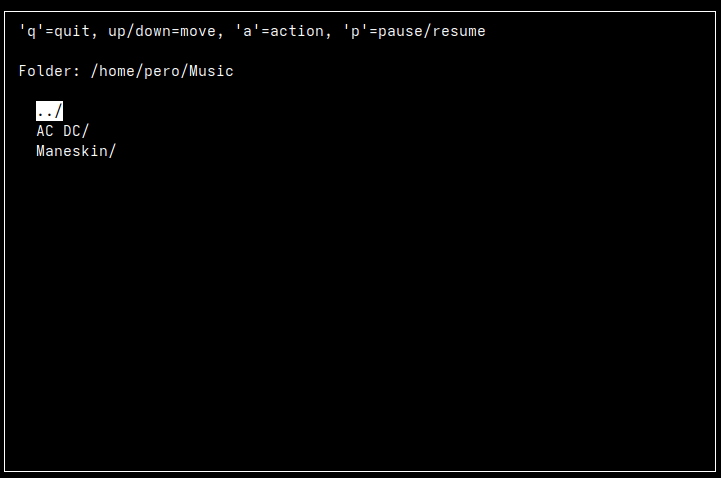

# TUI_MusicPlayer_Linux

A **lightweight, terminal-based music player** written in C++ using **ncurses** for the interface and **mpv** for audio playback. Browse folders, play MP3s, pause/resume, and see a live progress bar—all inside your terminal.  



## Features

- Browse directories and view MP3 files.
- Navigate with arrow keys.
- Play MP3 files using `mpv`.
- Pause/resume playback with a key press.
- Automatic playback of the next song in the folder.
- Live progress bar showing song duration.


## Controls

- Up - Move up
- Down - Move down
- a - Enter folder / Play
- p - Pause / Resume
- q - Quit


## Requirements

- **C++17 compatible compiler** (g++, clang++)
- **ncurses** library
- **mpv** media player
- **ffprobe** (part of **ffmpeg**) for reading MP3 durations

### Install on Ubuntu/Debian
```bash
sudo apt update
sudo apt install g++ ncurses-dev mpv ffmpeg
```

### Install on Fedora
```bash
sudo dnf install gcc-c++ ncurses-devel mpv ffmpeg
```

### Install on Arch
```bash
sudo pacman -Syu gcc ncurses mpv ffmpeg
```
