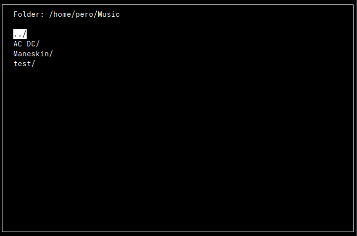

# TUI_MusicPlayer_Linux

A **lightweight, terminal-based music player** written in C++ using **ncurses** for the interface and **mpv** for audio playback. Browse folders, play MP3s, pause/resume, and see a live progress bar—all inside your terminal.  



## Features

- Browse directories and view MP3 files.
- Navigate with arrow keys.
- Play MP3 files using `mpv`.
- Pause/resume playback with a key press.
- Automatic playback of the next song in the folder.
- Live progress bar showing song duration.


## Controls

- Up - Move up
- Down - Move down
- a - Enter folder / Play
- p - Pause / Resume
- q - Quit


## Requirements

- **C++17 compatible compiler** (g++, clang++)
- **ncurses** library
- **mpv** media player
- **ffprobe** (part of **ffmpeg**) for reading MP3 durations

### Install on Ubuntu/Debian
```bash
sudo apt update
sudo apt install g++ ncurses-dev mpv ffmpeg
```

### Install on Fedora
```bash
sudo dnf upgrade --refresh
sudo dnf install gcc-c++ ncurses-devel mpv ffmpeg
```

### Install on Arch
```bash
sudo pacman -Syu gcc ncurses mpv ffmpeg
```


## To-Do

- [x] Switch audio playback to **ffmpeg**
- [x] Add **theme** support
- [x] Add additional **themes**
- [x] Reformat the **code**
- [x] Fix **border overlapping** with song names
- [x] Resolve song length bar **glitching** when resizing
- [x] Add **scrolling** for long song lists
- [ ] Implement controls **menu**
- [ ] Add **repeat** and **shuffle**
- [ ] Add **volume control** and **better song skipping** 
- [ ] Add **metadata** reading (title, artist, album)
- [ ] Implement **termgl** addon for better graphics
- [ ] Add more **file type** support
- [ ] Add folder **manipulation**


## Compilation

To compile the program from source, follow these steps:

1. **Clone the repository:**

    ```bash
    git clone https://github.com/Per0123/TUI_MusicPlayer_Linux.git
    cd TUI_MusicPlayer_Linux
    ```

2. **Compile the code:**

    You will need a **C++17** compatible compiler and **ncurses** library to build the program.

    ```bash
    g++ musicPlayer.cpp -o musicPlayer -lncurses
    ```

3. **Run the music player:**

    After compiling, you can run the program like this:

    ```bash
    ./musicPlayer
    ```

## Usage

1. Navigate to your **Music folder** or any folder containing MP3 files.
2. Use the **Up** and **Down** arrow keys to navigate through the list.
3. Press **`a`** to play a song or enter a folder.
4. Press **`p`** to pause and resume playback.
5. Press **`q`** to quit the program.

Once a song finishes, the next available song in the folder will start playing automatically.

## License

This project is licensed under the **MIT License**. You are free to use, modify, and distribute the software, but you must provide attribution to the original author. See the [LICENSE](LICENSE) file for more details.
